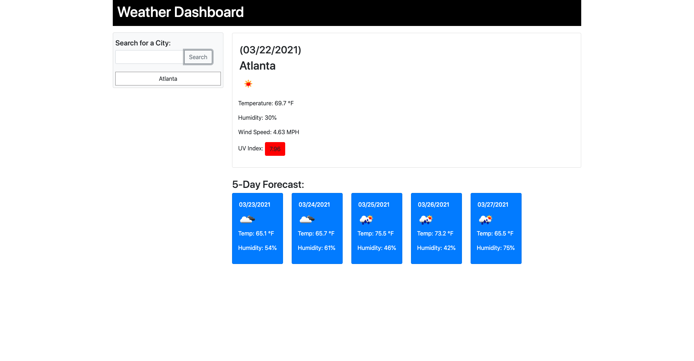
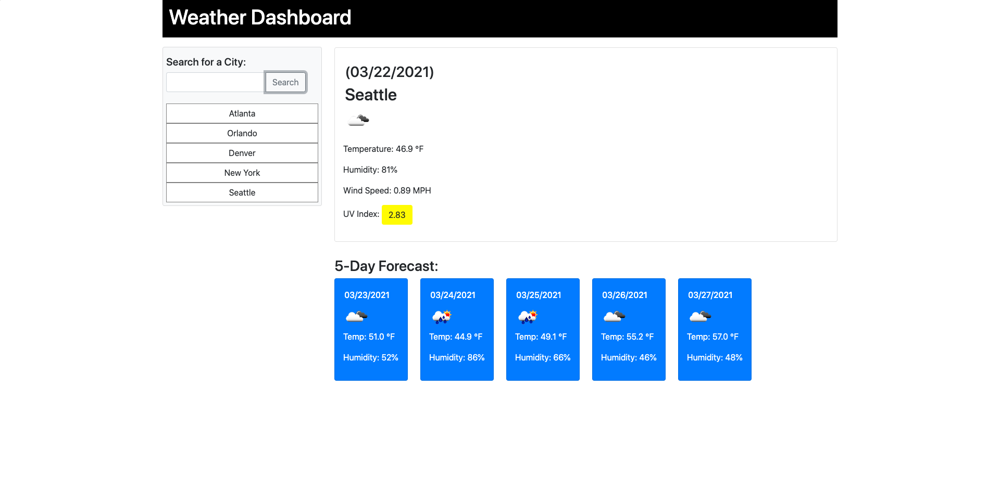

# Weather App

For this assignment I was tasked with creating a weather application. Weather data is provided by OpenWeather API. Once the user searches for a city, the city name, the date, an icon representation of weather conditions, the temperature, the humidity, the wind speed, and the UV index are displayed. Additionally, the UV Index is color coded to indicate whether the UV Index conditions are favorable, moderate, or severe. Lastly, the 5-Day Forecast weather data is provided that displays the date, an icon representation of weather conditions, the temperature, and the humidity.

## I practiced the following:
1. Accessing third-party data using API calls
2. Additional practice with Day/Time formatting using Momentjs
3. Formatting and using Epoch Unix time

## Screenshots

### Live Site:
#### [Weather App](https://sranson.github.io/weather-app/)

### Future Enhancements
1. Improve styling

### Contributors and tools used
1. OpenWeather Weather API
2. Postman Platform

## License
Permission is hereby granted, free of charge, to any person obtaining a copy of this software and associated documentation files (the "Software"), to deal in the Software without restriction, including without limitation the rights to use, copy, modify, merge, publish, distribute, sublicense, and/or sell copies of the Software, and to permit persons to whom the Software is furnished to do so, subject to the following conditions:

The above copyright notice and this permission notice shall be included in all copies or substantial portions of the Software.

THE SOFTWARE IS PROVIDED "AS IS", WITHOUT WARRANTY OF ANY KIND, EXPRESS OR IMPLIED, INCLUDING BUT NOT LIMITED TO THE WARRANTIES OF MERCHANTABILITY, FITNESS FOR A PARTICULAR PURPOSE AND NONINFRINGEMENT. IN NO EVENT SHALL THE AUTHORS OR COPYRIGHT HOLDERS BE LIABLE FOR ANY CLAIM, DAMAGES OR OTHER LIABILITY, WHETHER IN AN ACTION OF CONTRACT, TORT OR OTHERWISE, ARISING FROM, OUT OF OR IN CONNECTION WITH THE SOFTWARE OR THE USE OR OTHER DEALINGS IN THE SOFTWARE.